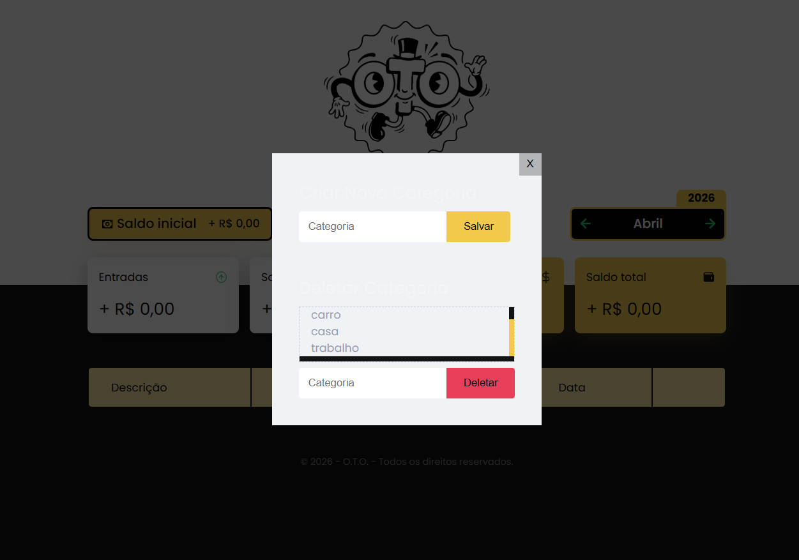
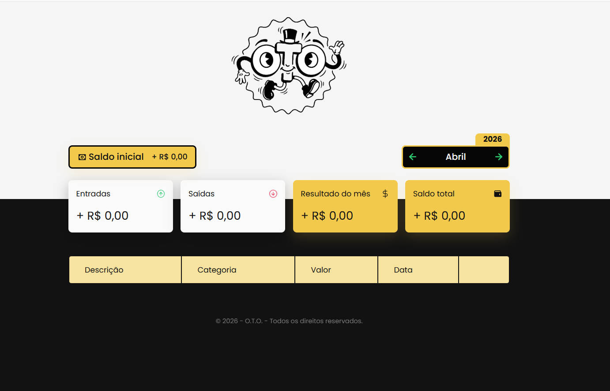
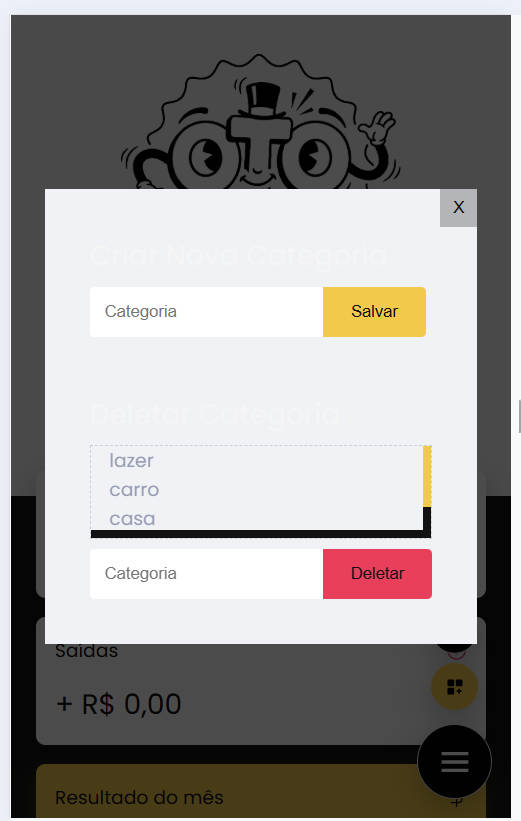
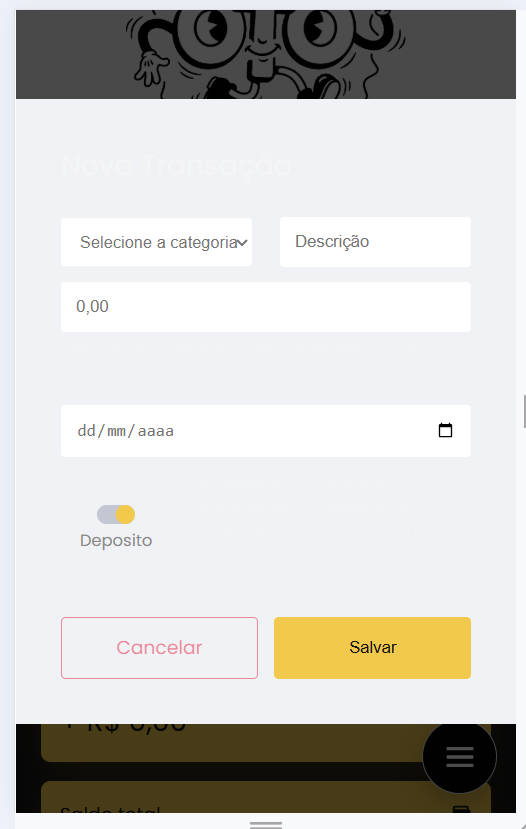
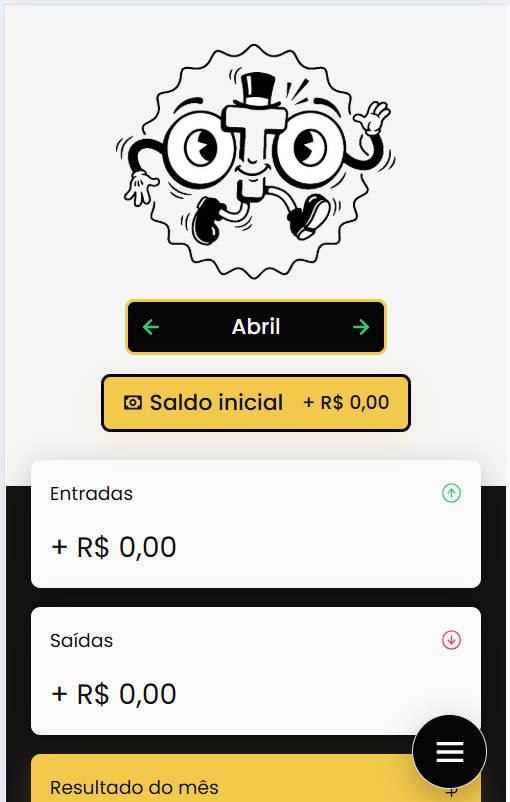
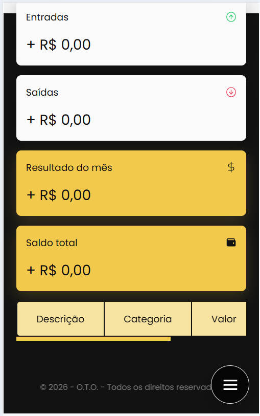

<h1 align="center">
  <br>
    
</h1>
<p align="center">
    
    
    
    <a href="https://github.com/JhuanNohl/OTO/blob/main/LICENSE">
        
    </a>
</p>
<p align="center">
    <a href="#oto-">Projeto</a>&nbsp;&nbsp;&nbsp;|&nbsp;&nbsp;&nbsp;
    <a href="#tecnologias-">Tecnologias</a>&nbsp;&nbsp;&nbsp;|&nbsp;&nbsp;&nbsp;
    <a href="#layout-">Layout</a>&nbsp;&nbsp;&nbsp;|&nbsp;&nbsp;&nbsp;
    <a href="#feedbacks-">Feedbacks</a>&nbsp;&nbsp;&nbsp;|&nbsp;&nbsp;&nbsp;
    <a href="#licença-%EF%B8%8F">Licença</a>
</p>

# OTO 
OTO é um organizador financeiro em desenvolvimento, criado para registrar entradas e saídas de forma simples, acompanhar o saldo e apoiar uma visão mais clara da rotina financeira.

O projeto está sendo desenvolvido de forma autoral a partir de um MVP encontrado no GitHub. A base inicial foi adaptada para validar ideias próprias de interface, organização visual e fluxo de uso.

#### Funcionalidades
* Registro de entradas e saídas financeiras
* Exclusão de transações cadastradas
* Visualização de saldo, receitas e despesas
* Interface responsiva para desktop e mobile
* Botão flutuante para abertura do modal de cadastro
* Validação de formulário com toast de erro
* Destaque visual do card de total conforme o saldo

## Tecnologias 🚀
Esse projeto foi desenvolvido com as seguintes tecnologias:

- [HTML](https://pt.wikipedia.org/wiki/HTML)
- [CSS](https://pt.wikipedia.org/wiki/Cascading_Style_Sheets)
- [Javascript](https://pt.wikipedia.org/wiki/JavaScript)

## Layout 🚧
#### Desktop Screenshot
<div style="display: flex; flex-direction: 'column'; align-items: 'center';">
<!-- Responsive, 1440 x 900, 50% (Laptop L - 1440px)-->
    
    
</div>

#### Mobile Screenshot
<div style="display: flex; flex-direction: 'row';">
<!-- Responsive, 425 x 900, 60% (Mobile L - 425px)-->
    
    
    
    
</div>

## Rodando o projeto 🚴🏻‍♂️

```bash

# Clone o repositório
$ git clone https://github.com/JhuanNohl/OTO.git

# Acesse a pasta do projeto no prompt de comando
$ cd OTO

# Abra o projeto com o navegador de sua preferência
$ index.html
```

## Feedbacks 💭
O OTO ainda está em fase inicial e passa por ajustes de identidade, interface e experiência de uso.

Feedbacks sobre fluxo, clareza das informações, responsividade e melhorias de organização são bem-vindos por meio das issues do repositório.

## Licença ⚖️
Este projeto está sob a licença do MIT. Veja o arquivo [LICENSE](https://github.com/JhuanNohl/OTO/blob/main/LICENSE) para mais detalhes.
